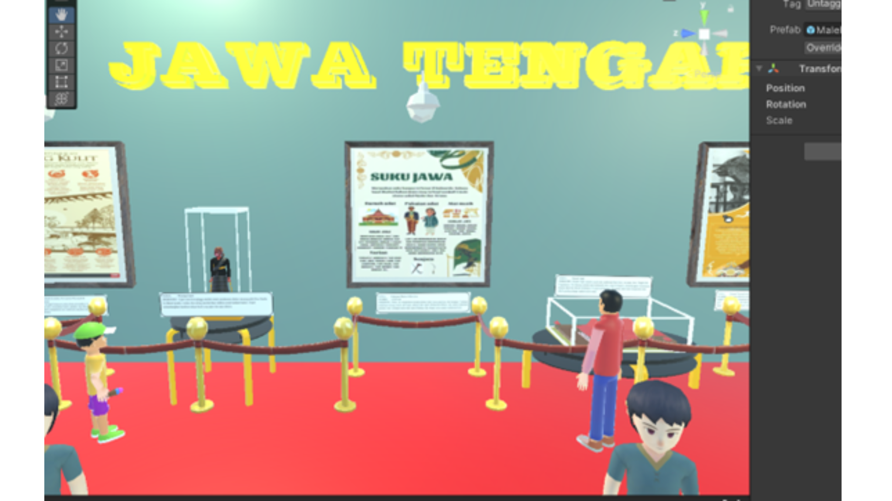
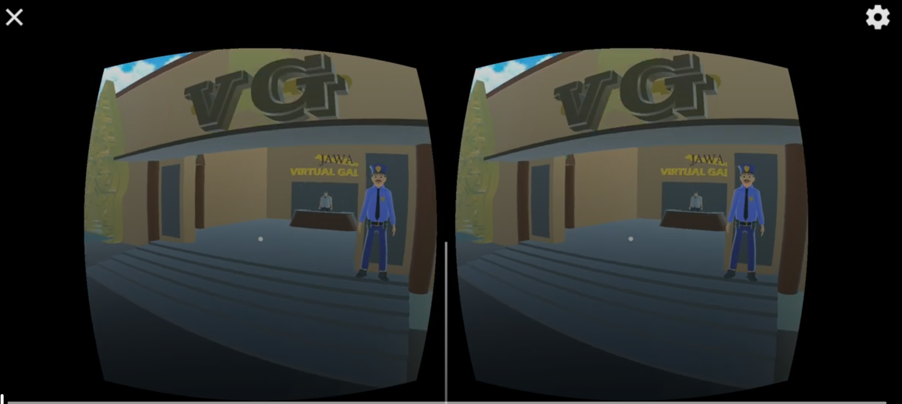
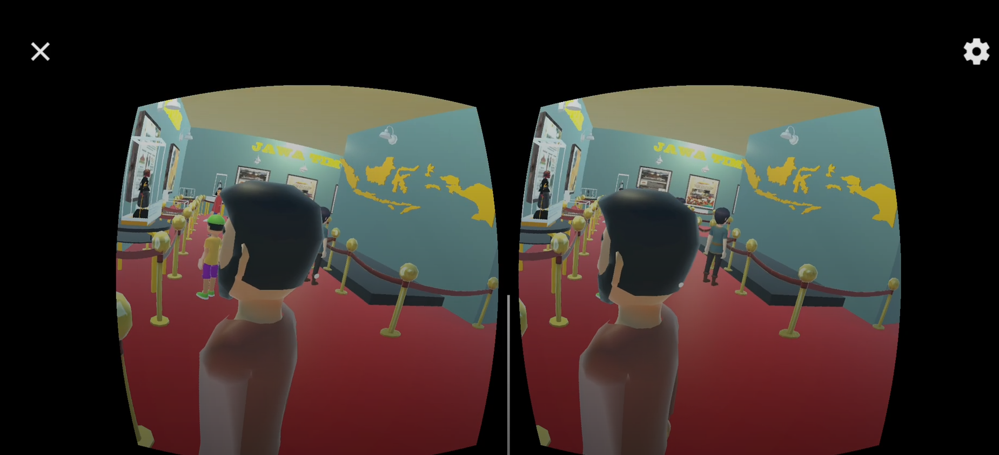

# Pesona Jawa Raya: Galeri Virtual Reality Kebudayaan Jawa

🎮 Sebuah aplikasi Virtual Reality berbasis Android yang memungkinkan pengguna mengeksplorasi kebudayaan Jawa secara imersif melalui galeri virtual. Proyek ini dikembangkan menggunakan Unity dan SketchUp, serta mendukung perangkat Google Cardboard.

---

## 📌 Deskripsi Singkat

Aplikasi ini bertujuan untuk:
- Memperkenalkan budaya Jawa (Jawa Barat, Tengah, Timur) secara interaktif.
- Memberikan pengalaman eksplorasi budaya dalam bentuk galeri virtual.
- Mendukung edukasi dan pelestarian budaya tradisional melalui teknologi VR.

---

## 🧠 Fitur Utama

- Player bergerak otomatis (AutoMoveForward).
- Interaksi berbasis Google Cardboard.
- Galeri berisi asset budaya: Wayang, Senjata Tradisional, Rumah Adat.
- Desain arsitektur dari SketchUp, diimpor ke Unity.
- Optimasi untuk Android VR experience.

---

## 🔧 Tools dan Teknologi

| Teknologi       | Deskripsi                                      |
|----------------|------------------------------------------------|
| Unity LTS 2022 | Engine utama VR development                    |
| SketchUp Pro   | Desain bangunan galeri dan lingkungan          |
| XR Plugin      | Integrasi Google Cardboard                     |
| Android Build  | Build final untuk perangkat Android             |

---

## 📦 Download APK & Source Code

> Karena ukuran file terlalu besar untuk GitHub, kami menyediakan file melalui Google Drive.

📂 **Google Drive Folder:**  
[🔗 Klik di sini untuk mengakses APK & file lengkap](https://drive.google.com/drive/folders/1WXh_Ky7YS_A30zhA_n1xWoYvH2jRWKRs)

---

## 🧪 Dokumentasi

Laporan lengkap, panduan instalasi, dan penjelasan teknis tersedia di folder Google Drive tersebut. Berikut beberapa highlights:
- Langkah-langkah pembuatan dari SketchUp → Unity → Android
- Penggunaan asset seperti Wayang Golek, Keris, Rumah Joglo
- Sistem collider, lighting, dan integrasi VR
- Desain pameran dan tata letak galeri virtual

---

## 👨‍💻 Tim Pengembang (Kelompok 1)

- Ariq Mahira Chandra (2310511009)  
- Andrian Hidayah Nurfajrin (2310511011)  
- Fauzio Yunus Alim (2310511020)  
- **Pandu Nugraha Saputra** (2310511029)

---

## 📚 Lisensi

MIT License – Silakan gunakan, modifikasi, dan distribusikan proyek ini dengan bebas, selama menyertakan atribusi kepada pembuatnya.

---

## 📷 Screenshot & Preview

  
_Tampilan galeri budaya dalam mode Unity_

---
  
_Tampilan galeri budaya dalam mode VR_

---
  
_Tampilan galeri budaya dalam mode VR_

---

## 📥 Cara Menjalankan

1. Install APK ke perangkat Android (landscape mode disarankan)
2. Gunakan Google Cardboard untuk pengalaman VR penuh
3. Jelajahi dan pelajari aset budaya Jawa di dalam galeri

---

> Jika kamu tertarik untuk berkolaborasi atau mengembangkan lebih lanjut (misalnya dengan narasi, mini-game, atau AI), silakan hubungi kami!

